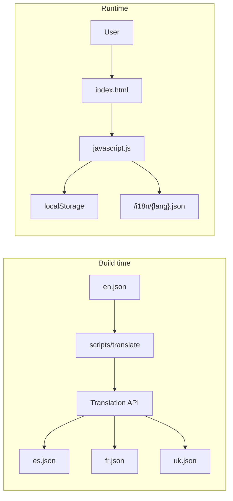

# Build-time automatic localization plan

## Current state

- **No i18n today**: No `/i18n` or `scripts` folder; UI strings are hardcoded in [templates/index.html](templates/index.html) and [static/javascript.js](static/javascript.js).
- **Flask**: Serves templates and `/static/*`; no route for arbitrary project files. So `/i18n/*.json` must be either served from `static/` or via a new route.
- **UI strings to translate**: Banner "Engaging Reader", "Upload File", disclaimer text, aria-labels, "Loading", "Speed", "Definition", and in JS: `announceStatus` / `announceError` messages (e.g. "Processing file, please wait...", "Please select a file first.", "Getting definition for ...").

## Architecture




## 1. i18n JSON structure and location

- **Path**: `/i18n/en.json` as the single source; generated files `/i18n/es.json`, `fr.json`, `uk.json`, `fil.json` (Tagalog), `tr.json`, `pt.json`, `pa.json` (Punjabi, Gurmukhi script).
- **Format**: Flat key-value for simplicity and easy diffing. Example:

```json
{
  "app.title": "Engaging Reader",
  "upload.label": "Upload File",
  "upload.ariaLabel": "Upload document: click to browse files or drag and drop. Supported: Images and PDF files up to 50MB",
  "disclaimer.bold": "Engaging Reader is not intended to handle sensitive personal data.",
  "disclaimer.regular": "Please do not upload documents with financial information, government ID numbers, medical details, or other confidential content.",
  "status.loading": "Loading",
  "status.processing": "Processing file, please wait...",
  "status.extracted": "Text extracted successfully. Use spacebar to start reading or tab to navigate words.",
  "status.gettingDefinition": "Getting definition for \"{{word}}\"",
  "errors.selectFile": "Please select a file first.",
  "errors.invalidType": "Invalid file type. Please select an image or PDF file.",
  "errors.fileTooLarge": "File too large. Please choose a file under 50MB.",
  "errors.processFailed": "Failed to process file. Please try again.",
  "speed.label": "Speed",
  "definition.title": "Definition",
  "aria.textDisplay": "Extracted text content"
}
```

- **Serving**: Add a Flask route in [app.py](app.py) to serve `i18n` from the project root (e.g. `GET /i18n/<lang>.json` → `send_from_directory('i18n', f'{lang}.json')`) so the runtime can `fetch('/i18n/en.json')` etc. without moving files into `static/`.

## 2. Build script: translation as its own module

- **Layout**: Treat the translation tooling as a self-contained module under `scripts/translate/`:
  - **Entry point**: `scripts/translate/index.js` (or `cli.js`) — the single file that build/CI runs: `node scripts/translate/index.js`. Can also add a root-level npm script or Make target that invokes this.
  - **Optional internal split**: For clarity and testing, the entry point can require/import small helpers from the same module (e.g. `lib/diff.js` for computing keys-to-translate, `lib/adapters/libre.js`, `lib/adapters/deepl.js` for API calls). The rest of the project only invokes the entry point; it does not depend on these internals.
  - **Optional `scripts/translate/package.json**`: If a provider needs a dependency (e.g. Google Cloud client), add a `package.json` only inside `scripts/translate/` and run the entry point from that directory (`cd scripts/translate && node index.js`) or via `node --experimental-strip-types` / plain Node. The main app stays dependency-free; the translation module owns its own dependencies.
- **Paths**: The module reads the source from and writes outputs to a single i18n directory (default: project root `i18n/`). Resolve that path from the script’s location (e.g. `path.join(__dirname, '../../i18n')`) or via env (e.g. `I18N_DIR`). No hardcoded assumptions about the rest of the repo layout.
- **Runtime**: Node.js 18+ (native `fetch`) for the default LibreTranslate path; no root-level `package.json` required unless the project wants a single `npm run translate` command.
- **Inputs**:  
  - Source: `i18n/en.json`.  
  - Targets: Spanish `es`, French `fr`, Ukrainian `uk`, Tagalog `fil`, Turkish `tr`, Portuguese `pt`, Punjabi (Gurmukhi) `pa` (configurable via constant or env).
- **Logic**:
  1. If `SKIP_I18N_TRANSLATE=1` (or `TRANSLATE_I18N=0`), log and exit 0 immediately.
  2. Read `en.json` and parse.
  3. For each target language:
    - If `i18n/{lang}.json` exists, load and parse; otherwise start with `{}`.
    - For each key in `en.json`: if key is missing in target **or** the **English** value for that key changed (compare current `en[key]` to a stored “last source” — see below), mark for translation.
  4. “Changed” detection: either (A) store a copy of last-used en strings inside each `{lang}.json` under a reserved key (e.g. `__source__`) and diff against current `en.json`, or (B) always translate any key where target value is missing. Option (A) preserves existing translations when only **other** keys change; option (B) is simpler but re-translates when en value changes (no stored source). **Recommendation**: (A) — add `__source__: { key: enValue }` in each generated file and only translate keys that are new or where `__source__[key] !== en[key]`.
  5. If the total number of keys to translate across all languages is 0, log "No i18n changes; skipping translation." and exit 0 (no API calls, no writes).
  6. Call translation API for each (key, enText) in the “to translate” set (batch per language if the API allows).
  7. Merge results into existing `i18n/{lang}.json`, update `__source__` for translated keys, write file.
  8. Log which languages were updated and how many strings translated.
- **API choice**: Support three backends via env (e.g. `TRANSLATE_API=libre|deepl|google` and optional `TRANSLATE_API_URL`, `DEEPL_API_KEY`, `GOOGLE_APPLICATION_CREDENTIALS`). Default to **LibreTranslate** (public or self-hosted) for low/no cost; document one public instance or Docker for self-host.
- **Idempotency**: Re-running with no changes in en and no new keys should translate 0 strings and not overwrite files unnecessarily.

### 2a. Translate only on certain builds (skip when no text changes)

- **Goal**: Avoid API calls and file writes when nothing changed, and allow builds to opt out of translation entirely.
- **Change-based skip** (default behavior):
  1. After loading `en.json` and each target file, compute the set of keys that need translation (new or changed per language).
  2. If, across all target languages, there are **zero** keys to translate, log e.g. `No i18n changes; skipping translation.` and **exit with code 0**. Do not call the translation API or write any files. Build continues successfully.
  3. If there is at least one key to translate for any language, proceed as today (call API, merge, write, log which languages were updated).
- **Opt-out env** (skip translation on this build regardless of changes):
  - If `SKIP_I18N_TRANSLATE=1` (or `TRANSLATE_I18N=0`), the script exits immediately with code 0 and a short log message. No diff, no API, no writes. Use in CI when the build does not need updated locale files (e.g. test jobs, PR checks that didn’t touch `i18n/`).
- **Usage in CI**:
  - **Option A**: Run `node scripts/translate.js` on every build. When `en.json` (and thus source strings) didn’t change, the script exits quickly with no API usage.
  - **Option B**: Run the script only when `i18n/en.json` (or `i18n/`) is in the changed files (path filter in GitHub Actions / other CI). Only those “i18n-aware” builds run translation.
  - **Option C**: Run translation only on release or main-branch builds; on other branches set `SKIP_I18N_TRANSLATE=1` or don’t run the script.

## 3. Runtime: language loading and `t(key)`

- **Where**: Add a small inline script in [templates/index.html](templates/index.html) that runs before the main app script (or a small separate `i18n.js` loaded first), plus call sites in [static/javascript.js](static/javascript.js) and optional `data-i18n` in HTML.
- **Behavior**:
  - **Locale resolution**: If `localStorage.getItem('locale')` is set and is one of the supported codes, use it. Otherwise **auto-detect from the browser**: use `navigator.language` and `navigator.languages` (in order), map each to a supported locale (e.g. `en-US` → `en`, `uk` → `uk`; handle `tl`/`fil` for Tagalog). Use the first browser language that matches the supported set (`en`, `es`, `fr`, `uk`, `fil`, `tr`, `pt`, `pa`). If none match, use `'en'`. Persist the resolved locale to `localStorage` so the next visit keeps it until the user changes it via the switcher.
  - **Load**: On page load, `fetch(\`/i18n/${locale}.json)`(using the new Flask route), parse JSON, store in a global object (e.g.`window.__translations` or a module-level variable).
  - **t(key)**: Function that returns `translations[key] || key` (optional: support simple `{{word}}` substitution for keys like `status.gettingDefinition`).
  - **Switch language**: Set `localStorage.setItem('locale', newLang)`, fetch new JSON, update stored translations, then either reload the page or re-apply all UI strings (replace text in nodes with `data-i18n` and re-run any JS that sets text from `t(...)`). Page reload is the simplest and most reliable; optional: update DOM without reload if we have a single place that applies translations.
- **Apply translations**: (1) On load (and after switch if not reloading): for each element with `data-i18n="key"`, set `textContent` or `innerHTML` to `t(key)`. (2) In [static/javascript.js](static/javascript.js), replace hardcoded strings passed to `announceStatus`, `announceError`, and to DOM (e.g. definition title, loading label) with `t('key')`.  
- **Order**: Load i18n script first, then ensure `t()` is available when the rest of the app runs (e.g. call `applyUITranslations()` after translations load, or use a small init that awaits fetch then sets globals and runs the rest).
- **Ukrainian (Cyrillic) font**: Use **Atkinson Hyperlegible Next** for the UI when the locale is Ukrainian (or for all locales). It supports Cyrillic, so no separate fallback font is needed for `uk`.

## 4. Translation API details (script only)

- **LibreTranslate**: POST to `https://libretranslate.com/translate` (or `TRANSLATE_API_URL`) with `q`, `source: 'en'`, `target`, `format: 'text'`. No key required for public instance; rate limits may apply. For self-hosted, set URL in env.
- **DeepL**: Use REST API with `DEEPL_API_KEY`; translate per string or in small batches.
- **Google Cloud Translation**: Use `@google-cloud/translate` or REST with a service account; only add this dependency if the user chooses Google; otherwise keep script dependency-free for LibreTranslate path.

Script will accept optional env vars so one can switch provider without code change.

## 5. Workflow summary

1. Edit `i18n/en.json` (add or change UI strings).
2. Run the translation module: `node scripts/translate/index.js` (optionally with `TRANSLATE_API=libre` and `TRANSLATE_API_URL` if self-hosted).
3. Script updates only `i18n/{lang}.json` for languages that had new/changed keys and logs which were updated.
4. Deploy; at runtime the app fetches `/i18n/<locale>.json`, uses `t(key)` and stored locale; no translation API calls in the browser.

## 6. Deliverables checklist


| Deliverable                   | Action                                                                                                                                                                                                                                                                                                  |
| ----------------------------- | ------------------------------------------------------------------------------------------------------------------------------------------------------------------------------------------------------------------------------------------------------------------------------------------------------- |
| **scripts/translate/ module** | New Node module: entry point `scripts/translate/index.js` (and optional `lib/` helpers). Reads en + existing lang files, diff with `__source__`, call chosen API, merge and write, log updated languages. Optional `package.json` inside the module for provider-specific deps.                         |
| **Updated /i18n structure**   | Create `i18n/en.json` with keys covering current UI (example above). Add one example locale file (e.g. `i18n/fr.json` or `i18n/es.json`) (can be generated by script or hand-written sample).                                                                                                           |
| **Flask route**               | In [app.py](app.py), add route to serve `i18n/<lang>.json` via `send_from_directory`.                                                                                                                                                                                                                   |
| **Runtime snippet**           | Minimal JS: load locale from localStorage, fetch JSON, `t(key)` with optional `{{var}}` substitution, `setLocale(newLang)` that saves and reloads or re-applies DOM; apply `data-i18n` and replace hardcoded strings in [static/javascript.js](static/javascript.js) with `t('...')` where appropriate. |
| **HTML**                      | Add `data-i18n` attributes to translatable nodes in [templates/index.html](templates/index.html) and include the i18n bootstrap script (or inline).                                                                                                                                                     |


## 7. Optional: language switcher UI

- Add a small dropdown or buttons (e.g. in header or footer) listing English (en), Spanish (es), French (fr), Ukrainian (uk), Tagalog (fil), Turkish (tr), Portuguese (pt), Punjabi (pa); on change call `setLocale(code)` and reload (or re-apply). Not strictly required for “allow users to switch languages” but needed for discoverability; can be a minimal control.

## 8. Constraints addressed

- **UI only**: Only keys in en.json used for labels, messages, aria; no SEO or regional variants.
- **Good enough MT**: LibreTranslate default; user can switch to DeepL/Google if they prefer.
- **Low cost**: LibreTranslate free/public or self-hosted; no API key required for default path.
- **No runtime API**: All translation at build time; runtime only fetches static JSON.

